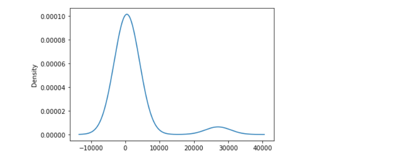
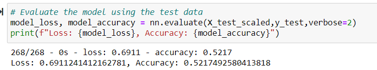
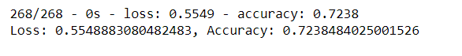

# Neural_Network_Charity_Analysis

## Overview of the analysis: 
With our knowledge of machine learning and neural networks, we used the features in the provided dataset to help create a binary classifier that is capable of predicting whether applicants will be successful if funded by Alphabet Soup. From Alphabet Soup’s business team, we received a CSV containing more than 34,000 organizations that have received funding from Alphabet Soup over the years. Take a look at our outcomes.

## Result:
As we looked at our datset we noticed that we had a huge data set that was loaded with unneeded data for our model. We were able to drop off a few columns to scale down an maximize our model outputs. We also visulized the value counts of our application types and saw that there was a high density of value count between 0 and 1000. We were able to use this data to decide on what data we should focus on. 

We trained our model to target "Is successful" data in out set in order to narrow down the higher percentage of companies that will be successful with funding. 
While focusing on our application data we were able to drop data  such as "EIN" and "NAMES" that were are neither targets nor features, and removed them from the input data.

In order to maintain our accuracy we evaluated and tested our data using model loss and accuracy processes for our accuracy outcome below. 

Our model composed promarily of a layer 1 and layer 2 with 8 hidden nodes on layer 1 and 5 on layer 2. We had a total of 411 trainable params. As areuslt we only acheived 
a 69% accuracy with 62% loss. Since we were not able to achieve our targeted goal, we decided to re-run our model adding 6 neurons. with each of our try we fell short of our target of 75%, reaching 73%.
While this percentage was a few percentages off, we believe we were close enough to continue working with this data set to acheive our goals.

## Summary:
We were able to test, train  and analyze our data set in attempt to achieve our targeted goal. As we saw, we were not able to achieve our goal of 75%. However,
if we continued working with this data set we may be able to get to our goal by doing a few adjustments. Perhaps understanding more about what constitues "Sucessfull"
"Application Types" and having better insight to the "Classifiaction" and types of companies that have reached a 75% approval at one time wpuld assist in creating a more accurate model in the future.  

